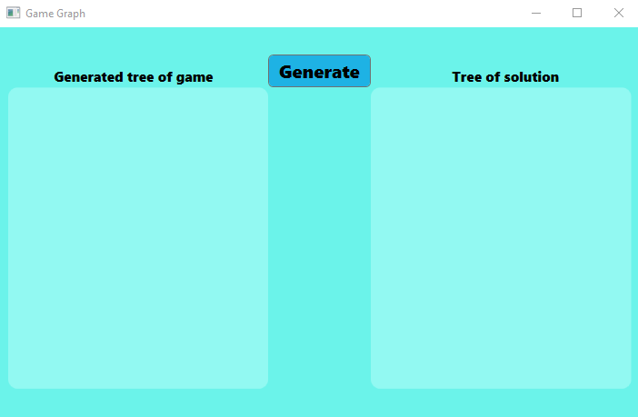
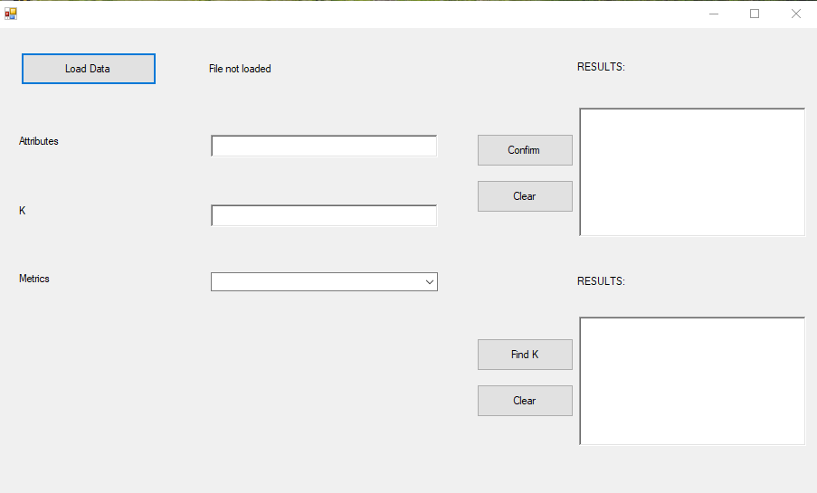
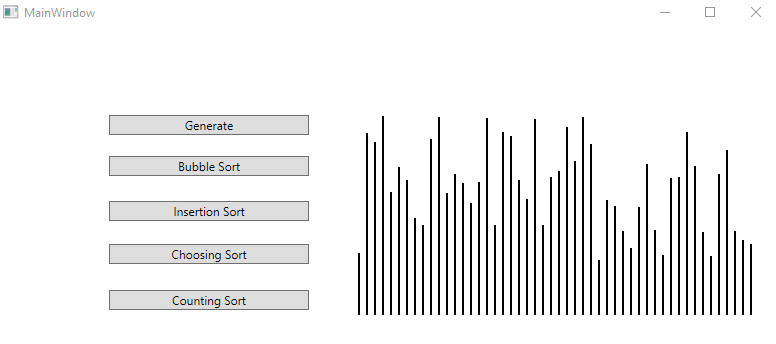

# Arificial Inteligence

Set of AI related projects. Written in C#.

---

## General Informations

#### This repository contains projects illustrating the following topics:

1. Genetic Algorithm
   
2. Searching for solutions using graphs
   
3. K-Nearest Neighbors Algorithm
   
4. Implementation of Neural Network
   
5. Visual presentation of sorting algorithms
   
